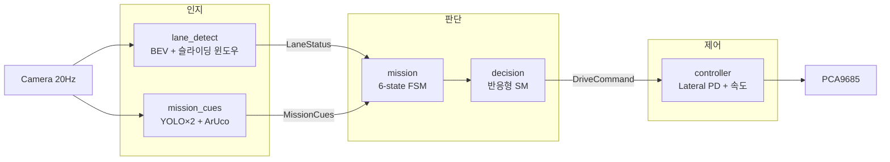

<p align="center">
  
</p>

# D-Racer SMT — 단일 카메라 자율주행 스택

**TOPST D3-G 스케일카 · ROS2 Humble 기반 경로추종 자율주행**

> **SEA:ME HACKATHON · 우승 (1st Place)** — Team SMT

전방 카메라 한 대로 차선 · 신호등 · 방향 팻말 · 동적 장애물을 인지하고, 6-state 미션 FSM으로 판단해 트랙 전 구간을 온보드(4-core ARM)에서 완주한다. 인지 · 판단 · 제어를 ROS2 커스텀 메시지(`LaneStatus`, `MissionCues`, `DriveCommand`)로 분리한 계층 구조.

- **인지** — BEV(IPM) + 슬라이딩 윈도우 차선검출 · YOLO×2(NCNN) 신호등/팻말 · ArUco 장애물
- **판단** — 2계층 상태기계 (상위 6-state 미션 FSM + 하위 반응형 SM)
- **제어** — Lateral PD + 곡률 피드포워드 조향 · 곡률 기반 종속도 (시뮬 ↔ 실차 동일 코드)

📄 설계 문서 — **[인지](docs/perception.md)** · **[판단](docs/planning.md)** · **[제어](docs/control.md)**

🎬 **주행 영상** — [대회 본선 주행 (YouTube)](https://youtube.com/shorts/sVNL-lCpRhU)

---

## 1. 시스템 아키텍처



계층 간 계약은 ROS2 커스텀 메시지로 고정한다.

| 메시지 | 방향 | 내용 |
|---|---|---|
| `LaneStatus` | 인지 → 판단 | 차선 검출 여부 · 횡오차 · heading 오차 · 차선 경로점 |
| `MissionCues` | 인지 → 판단 | 신호등/팻말 라벨 · ArUco 유무 · 구간 트리거 |
| `DriveCommand` | 판단 → 제어 | 목표 경로 · 조향 bias · 속도 스케일 · 게인 프로파일 |

**불변 규칙** — ① 인지는 조향·속도를 계산하지 않는다 ② 판단은 미션 상태와 지시만 만든다 ③ 제어는 지령만 입력받고 인지 내부를 모른다.

상세 설계: [`d_racer_autonomous/docs/architecture.md`](d_racer_autonomous/docs/architecture.md)

---

## 2. 미션 시나리오

```text
초록불 인식 → S자 흰 차선 주행 → 방향 팻말(좌/우) 분기
    → 흰선 폐루프 → 동적 장애물(아루코) 정지·재출발 → 빨간불 최종 정지
```

- 신호등 · 팻말 방향 = YOLO (자체 학습 2개)
- 차선 · 팻말 구간 트리거 = OpenCV
- 동적 장애물 = ArUco 마커

---

## 3. 저장소 구조

```text
├── d_racer_autonomous/          # 자율주행 스택 (팀 개발)
│   ├── core/                    #   ROS-free 코어: perception / planning / control
│   ├── sim/                     #   Bicycle Model 시뮬레이터 + 그리드 튜닝
│   ├── config/                  #   전 파라미터 YAML
│   ├── tests/                   #   pytest 단위·통합 테스트
│   ├── docs/                    #   아키텍처 · FSM · 캘리브레이션 · 인터페이스 계약
│   └── ros2_ws/src/
│       ├── d_racer_perception/  #   차선 + YOLO/ArUco 미션 큐 노드
│       ├── racer_bringup/       #   mission / decision / controller 노드 + 런치
│       └── racer_msgs/          #   계층 간 데이터 계약
├── src/                         # D-Racer Kit 기본 패키지 (+ 팀 수정)
└── docs/                        # 파트별 설계 문서 (인지 / 판단 / 제어)
```

코어 모듈 지도(파일별 역할·읽는 순서): [`core/README.md`](d_racer_autonomous/core/README.md)

---

## 4. 실행

```bash
# 빌드 (D3-G 보드, ROS2 Humble)
colcon build --symlink-install
source install/setup.bash

# 대회 주행 (전체 스택)
ros2 launch racer_bringup race.launch.py

# 차선 추종만 / 캘리브레이션
ros2 launch racer_bringup lane_follow.launch.py
ros2 launch racer_bringup calibration.launch.py
```

YOLO 가중치는 용량 문제로 미포함 — [`d_racer_perception/README.md`](d_racer_autonomous/ros2_ws/src/d_racer_perception/README.md) 참고.

---

## 5. 팀 SMT

| 이름 | 담당 | 주요 작업 |
|---|---|---|
| 강민준 | 인지 | 차선 검출(BEV·슬라이딩 윈도우), YOLO 데이터셋 구축·학습, ArUco 검출 |
| 최정윤 | 인지 | YOLO 학습·검증, NCNN 온보드 최적화(320px 15.5fps), 팻말 색 트리거 |
| 성주은 | 판단 | 6-state 미션 FSM, 반응형 하위 SM, 오검출 방어 로직 |
| 신동원 | 제어 | ROS-free 제어 코어, 시뮬레이터·그리드 튜닝, Lateral PD, 속도 프로파일 |

<!-- 프로필 링크: [강민준](https://github.com/아이디) -->

---

## 6. Base Kit & License

- 베이스 플랫폼: [TOPST D-Racer Kit](https://github.com/topst-development/D-Racer-Kit) (D3-G, ROS2 Humble)
- License: [LICENSE](LICENSE)
