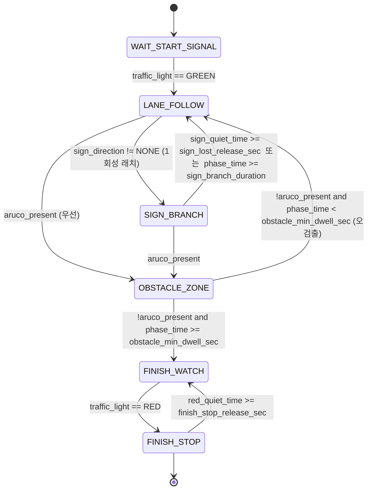

# 판단 (Planning) 설계 문서

> [README](../README.md)의 판단 파트 설계 근거·구현·검증을 정리한다.
> 담당 — 성주은 · 코드: [`d_racer_autonomous/core/planning/`](../d_racer_autonomous/core/planning/), 노드: [`ros2_ws/src/racer_bringup/`](../d_racer_autonomous/ros2_ws/src/racer_bringup/)

**목차**

1. [개요 — 2계층 상태기계](#1-개요--2계층-상태기계)
2. [상위 미션 FSM](#2-상위-미션-fsm)
3. [하위 반응형 SM](#3-하위-반응형-sm)
4. [인지·제어 지시 계약](#4-인지제어-지시-계약)
5. [오검출 방어](#5-오검출-방어)
6. [정지선 개루프 기동](#6-정지선-개루프-기동)
7. [파라미터](#7-파라미터)

> 값 표기 — 파라미터는 코드 스키마 기본값(`config_schema.py`)과 실차 YAML(`config/decision.yaml`·`config/mission.yaml`)이 다른 경우가 있다. 이 문서는 **실차 실효값 = YAML**을 기준으로 적는다.

---

## 1. 개요 — 2계층 상태기계

판단은 "지금 미션 어디쯤인가"와 "당장 어떻게 반응할까"를 분리한다. 인지 지시(ROI/YOLO 게이트)와 제어 지시(속도 스케일/게인 프로파일)를 만들 뿐, 조향·속도 값 자체는 계산하지 않는다(불변 규칙 ②).

- **상위 6-state 미션 FSM** (`MissionSequencer`, [`mission.py`](../d_racer_autonomous/core/planning/mission.py)) — 미션 진행 관리 + 인지·제어 지시 생성.
- **하위 반응형 SM** (`DecisionMaker`, [`decision.py`](../d_racer_autonomous/core/planning/decision.py)) — 각 주행 상태 안에서 `DRIVE / SLOW / STOP / LOST` 즉각 반응.

대회 주행(`race.launch.py`)은 `mission_node`(= 상·하위 계층 모두, **폐루프 앵커 차선** 설계)를 띄운다. 저장소에는 하위 계층만 쓰고 팻말을 개루프 고정조향으로 처리하는 옛 `decision_node`도 있으나, 두 노드는 배타이며 현재 코스에서 도는 것은 `mission_node`다. 상세: [`docs/mission_fsm.md`](../d_racer_autonomous/docs/mission_fsm.md).

---

## 2. 상위 미션 FSM

`MissionPhase`는 정확히 6개다.



전이 로직은 `mission.py`의 `_advance_phase()`이며, 타이머(`_phase_time`, `_sign_quiet_time`, `_red_quiet_time` 등)를 전이 판정 **직전에** 갱신한다.

| 전이 | 조건 |
|---|---|
| WAIT_START_SIGNAL → LANE_FOLLOW | `traffic_light == GREEN` |
| LANE_FOLLOW → OBSTACLE_ZONE | `aruco_present` (최우선) |
| LANE_FOLLOW → SIGN_BRANCH | `not _sign_done and sign_direction != NONE`, 진입 즉시 방향 래치 |
| SIGN_BRANCH → OBSTACLE_ZONE | `aruco_present` |
| SIGN_BRANCH → LANE_FOLLOW | `_sign_quiet_time ≥ sign_lost_release_sec` **또는** `_phase_time ≥ sign_branch_duration` |
| OBSTACLE_ZONE → FINISH_WATCH | `!aruco_present and _phase_time ≥ obstacle_min_dwell_sec` |
| OBSTACLE_ZONE → LANE_FOLLOW | `!aruco_present and _phase_time < obstacle_min_dwell_sec` (오검출 복귀) |
| FINISH_WATCH → FINISH_STOP | `traffic_light == RED` |

---

## 3. 하위 반응형 SM

`DriveState`는 `INIT / DRIVE / SLOW / STOP / LOST`. 한 프레임의 관측을 그대로 믿으면 상태가 매 프레임 떨리므로, 모든 전이는 **지속시간 타이머**를 통과해야 한다.

**유효 검출** — `lane_detected and num_points ≥ min_points(2) and confidence ≥ conf_min`(실차 0.20).

**전이 우선순위** (`_next_state`):

```python
# 1) 외부 정지요청 최우선
if obs.stop_request:                    return STOP
# 2) 미검출: 유예를 넘어야 LOST 확정 (짧은 끊김은 직전 상태 유지)
if not valid:
    self._invalid_time += dt; self._valid_time = 0
    if self._invalid_time >= lost_grace:  return LOST      # 실차 0.30s
    return 직전 상태 유지                                    # 떨림 억제
# 3) 복귀도 대칭으로 유예: 한 프레임 재검출로 출발하지 않음
if state in (INIT, LOST) and self._valid_time < recover_grace:  return 유지  # 0.10s
# 4) 정지선 (커브에선 무시)
in_curve = stopline_heading_gate > 0 and |heading_error| >= stopline_heading_gate   # 실차 0.40rad
if stop_line and not _stopline_done and not in_curve:
    if dist <= stop_trigger_dist(0.25):   return STOP
    if dist <= stop_approach_dist(0.60):  return SLOW
# 5) 신뢰도·오차 기반 DRIVE/SLOW
if confidence < conf_drive(0.60) or |heading_error| >= heading_slow(0.35) or |lateral_offset| >= offset_slow(0.12):
    return SLOW
return DRIVE
```

- LOST는 **정지 + 조향 마지막 값 유지**(fail-safe). 복귀도 `recover_grace`를 요구해 성급히 출발하지 않는다.
- 정지선 STOP은 `_stop_time`이 `stop_dwell(2.0s)`를 넘으면 `_stopline_done` 래치를 세워 같은 정지선에 다시 잡히는 데드락을 차단한다(`stop_request`에 의한 STOP은 dwell을 누적하지 않는다).
- **정지선 커브 게이트** — `stopline_heading_gate=0.40rad(≈23°)`. heading이 그 이상이면 정지선을 무시한다. 커브에서 가로로 눕는 차선을 정지선으로 오인하는 것을 막는다.
- 상태별 출력은 `speed_scale`로만 표현한다(DRIVE=`drive_speed_scale`, SLOW=`slow_speed_scale`+`slow_lookahead_scale`, STOP/LOST/INIT=`go=False`).

---

## 4. 인지·제어 지시 계약

판단의 출력 구조체 `DriveCommand`는 인지 지시와 제어 지시를 함께 담고, ROS 발행 시 두 메시지로 분리된다. 계약: [`docs/interfaces.md`](../d_racer_autonomous/docs/interfaces.md).

**인지 지시 → `LaneMode`**

| 필드 | 의미 |
|---|---|
| `roi_mode` | FULL / LOWER / LOWER_ARUCO 등. 페이즈별 매핑(LANE_FOLLOW·SIGN_BRANCH·FINISH_WATCH=LOWER, OBSTACLE_ZONE=LOWER_ARUCO) |
| `turn_bias` | SIGN_BRANCH 중 래치된 팻말 방향 |
| `yolo_enable` | 신호등 YOLO 페이즈 게이트 |
| `sign_enable` | 팻말 YOLO 페이즈 게이트 |

**제어 지시 → `DriveCommand`**

| 필드 | 의미 |
|---|---|
| `state` · `go` | 하위 SM 상태 · 주행 허가 |
| `speed_scale` | 목표속도 스케일 (상태별 감속·램프가 여기 반영) |
| `lookahead_scale` · `steer_limit` | lookahead·조향 상한 |
| `gain_profile` | DEFAULT / POST_SIGN (게인 **수치**는 제어의 `controller.yaml`, 판단은 프로파일 id만) |

> `DriveCommand.steer_bias`(개루프 조향 offset)는 계약에는 남아 있으나 **mission 경로에서는 상시 0**이다. 조향 offset은 제어단에서 계산하지 않고 인지단이 차선 중심선을 옮기는 방식(인지 §4)으로 대체했다. 즉 판단은 "어느 통로로 갈지"를 인지에 지시하고, 실제 평행이동은 인지가 한다.

---

## 5. 오검출 방어

편도 전이(되돌아올 길이 없는 상태 전환)는 오검출 한 번이 코스 전체를 날릴 수 있다. 전이마다 **물리적 사건 + 시간 조건**을 겹쳐 방어했다.

### 5.1 아루코 최소 체류시간

`FINISH_WATCH`는 편도라, 1프레임 오검출이 팻말 분기를 통째로 스킵할 수 있었다. `OBSTACLE_ZONE`에서 아루코가 사라져도 `_phase_time ≥ obstacle_min_dwell_sec(2.0s)`를 채워야 진짜로 본다. 미달이면 오검출로 판정하고 진입 전 상태로 복원한다. 인지의 `aruco_hold_sec(1.0s)`와 짝을 이뤄 실효 요구 체류를 만든다.

```python
if p == OBSTACLE_ZONE and not obs.aruco_present:
    if phase_time >= obstacle_min_dwell_sec:  set_phase(FINISH_WATCH)   # 충분히 머묾 → 진짜
    else:                                     set_phase(LANE_FOLLOW)    # 짧은 체류 = 오검출
```

### 5.2 팻말 분기 종료 = 물리적 사건

고정시간만 쓰면 팻말을 지나고도 offset을 계속 물고 달려 차선을 이탈한다(실차 확인). "팻말이 시야에서 사라짐"(`_sign_quiet_time ≥ sign_lost_release_sec=1.0s`)이라는, 속도·배터리에 흔들리지 않는 사건을 1차 종료 조건으로 삼고, 고정시간(`sign_branch_duration=5.0s`)은 폴백 상한으로만 둔다.

- **1회성 래치** — `_sign_done`(분기 완료, 재진입 차단), `_sign_dir`(첫 non-NONE 방향, 잠깐 NONE에도 안 풀림), `_yolo_relatch`(아루코 최초검출 시 신호등 YOLO 재점화).
- **YOLO 이중 게이트의 순환 의존 해소** — 팻말 진입 트리거가 팻말 YOLO의 출력이므로, 팻말 YOLO를 SIGN_BRANCH 전용으로 켜면 영영 진입할 수 없다. 그래서 `LANE_FOLLOW and not _sign_done`에서도 팻말 YOLO를 켠다.
- **분기 종료 곡선 게이트** — 속도 복귀를 시계가 아니라 "차선이 폈다"(`|heading_error| < sign_exit_straight_rad=0.20`)로 흘린다. 곡선 중에는 hold를 누적하고, `sign_exit_hold_max_sec` 초과 시에만 폴백으로 게이트를 무시한다. 복귀 시 `_start_exit_ramp()`로 속도를 계단이 아닌 램프(`sign_exit_ramp_sec=1.5s`)로 올려 합류를 안정화한다(스로틀 데드밴드 계단 회피).

### 5.3 빨간불 종료 방어

`FINISH_STOP`은 편도가 아니다. `_red_quiet_time ≥ finish_stop_release_sec(10.0s)`이면 `FINISH_WATCH`로 복귀할 수 있다. 진입 틱에 빨강을 봤으므로 이 값이 곧 **최소 정지시간**으로 작동한다.

---

## 6. 정지선 개루프 기동

[`stopline_maneuver.py`](../d_racer_autonomous/core/planning/stopline_maneuver.py) `StoplineManeuver`는 정지선 카운트 기반 **개루프 고정조향**(로터리 진입/탈출)이다. 폐루프 추종이 아니라 정해진 시간 동안 고정 raw 조향을 낸다: 1번째 정지선 → `first_dir(+1=좌)`, 2번째 → `second_dir(−1=우)`, 각 `duration_sec(1.5s)` 유지, `steer=0.35`, rising-edge + `debounce_sec` + `max_count=2`로 중복 카운트 방지.

현재 흰선 폐루프 코스에서는 **비활성**(`race.launch.py` 기본 off)이며, `MissionSequencer`가 호출하지 않는 제어단 재사용 대기 코드다.

---

## 7. 파라미터

실차 실효값(YAML)과 코드 스키마 기본값이 다른 주요 항목.

**하위 SM** (`decision.yaml` / `config_schema.py`)

| 파라미터 | 실차 YAML | 스키마 기본 |
|---|---|---|
| `conf_min` | 0.20 | 0.35 |
| `conf_drive` | 0.60 | 0.60 |
| `lost_grace` | 0.30 | 0.30 |
| `recover_grace` | 0.10 | 0.10 |
| `heading_slow` | 0.35 | 0.35 |
| `offset_slow` | 0.12 | 0.12 |
| `stop_trigger_dist` / `stop_approach_dist` | 0.25 / 0.60 | 0.25 / 0.60 |
| `stop_dwell` | 2.0 | 2.0 |
| `stopline_heading_gate` | 0.40 | 0.0 |
| `drive_speed_scale` / `slow_speed_scale` | 0.9 / 0.8 | 1.0 / 0.5 |

**상위 FSM** (`mission.yaml` / `config_schema.py`)

| 파라미터 | 실차 YAML | 스키마 기본 |
|---|---|---|
| `sign_branch_duration` | 5.0 | 5.0 |
| `sign_branch_speed_scale` | 0.3 | 0.5 |
| `sign_lost_release_sec` | 1.0 | 1.0 |
| `sign_exit_ramp_sec` | 1.5 | 1.5 |
| `sign_exit_straight_rad` | 0.20 | 0.20 |
| `obstacle_min_dwell_sec` | 2.0 | 2.0 |
| `finish_stop_release_sec` | 10.0 | 10.0 |

> `mission_node`는 `decision.yaml + mission.yaml`을 병합해 로드한다. 두 노드 모두 종료(`destroy_node`) 시 STOP/`go=False`를 1회 발행하고, `lane_status`가 `lane_timeout(0.3s)`을 넘게 끊기면 `lane_detected=False`로 강제해 유예 후 LOST로 정지시키는 워치독을 둔다.
